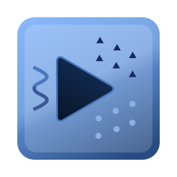

<h1 align="center">CoreML Player</h1>

Try your CoreML Models on multiple videos and images easily and quickly.

---

# Requirements
macOS 13.0+

Currently supports Object Detection and Classification models that can be used with Vision framework.

# Screenshots

For demo purposes and being able to test the functionality quickly, project includes a sample mlmodel file:

- YOLOv3Tiny: [https://github.com/pjreddie/darknet](https://github.com/pjreddie/darknet) (downloaded from [Apple's website]( https://developer.apple.com/machine-learning/models/))
